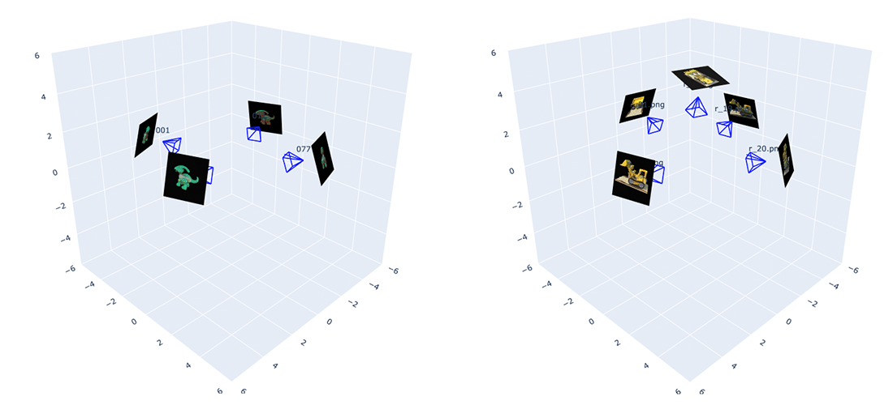
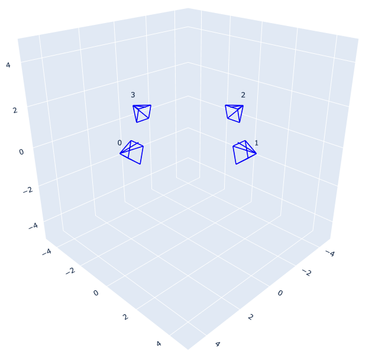
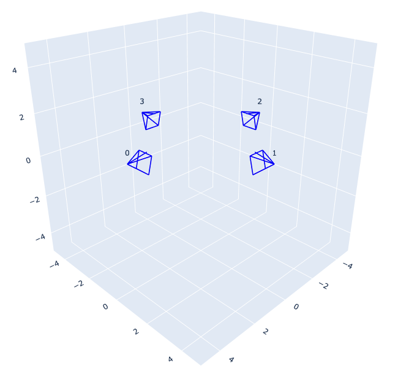
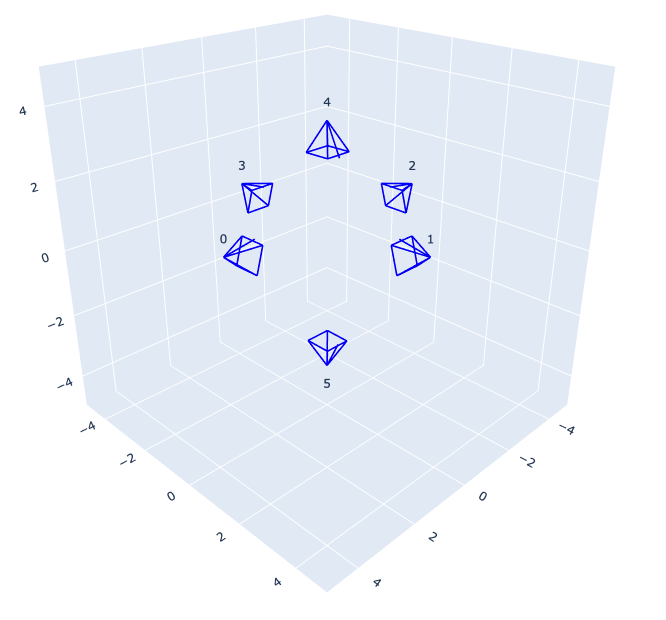
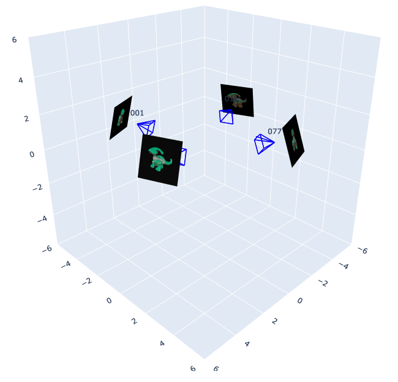
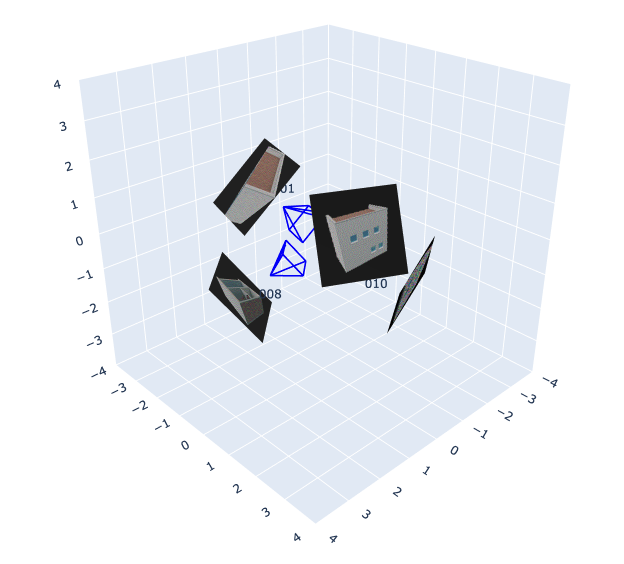
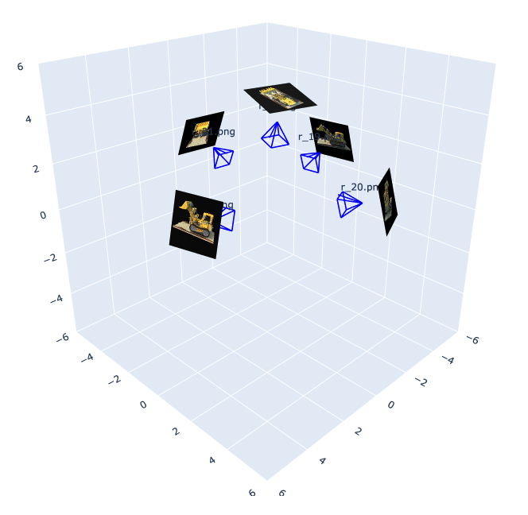
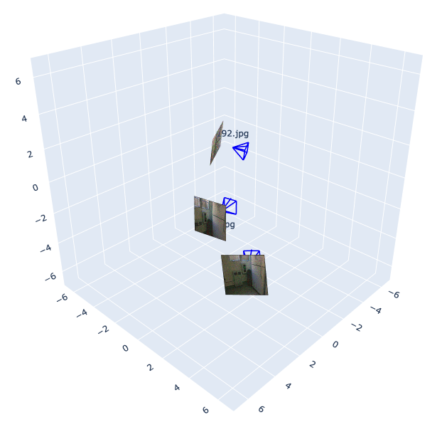

# CameraViewer: A lightweight tool for camera pose visualization
Visualize camera poses in seconds! 
A python tool that helps plot cameras for 3D computer vision research.



## Installation
Create an environment with Python >= 3.9 (Recommend to use [Anaconda](https://www.anaconda.com/download/) or [Miniconda](https://docs.conda.io/en/latest/miniconda.html))
```
conda create -n viewer python=3.9
conda activate viewer
pip install -r requirements.txt
```

## Run Demo
<a id="demo_sph"></a>
#### 1. Camera poses by positions in [spherical coordinates](https://en.wikipedia.org/wiki/Spherical_coordinate_system) (polar, azimuth, radius). 
Cameras will look at the origin point, and their up directions will be +Z.

Run the command in terminal:
```
python app.py --root inputs/quick/cam_sph/
```

The plotted figure will be opened in your browser:



<a id="demo_xyz"></a>
#### 2. Camera poses by positions in [cartesian coordinates](https://en.wikipedia.org/wiki/Cartesian_coordinate_system) (x, y, z). 
Cameras will look at the origin point, and their up directions will be +Z.
```
python app.py --root inputs/quick/cam_xyz/ --type xyz
```


<a id="demo_elu"></a>
#### 3. Camera poses by eye (camera) positions, look-at positions, and up vectors.
```
python app.py --root inputs/quick/cam_elu/ --type elu
```


<a id="demo_c2w"></a>
#### 4. Camera poses by camera-to-world matrix.
```
python app.py --root inputs/quick/cam_c2w/ --type c2w
```


<a id="demo_w2c"></a>
#### 5. Camera poses by world-to-camera matrix.
```
python app.py --root inputs/quick/cam_w2c/ --type w2c --image_size 128
```


#### 6. Camera poses in NeRF format. 
Poses are read from ```transforms.json``` under ```--root``` folder.
```
python app.py --root inputs/nerf/lego/ --format nerf --scene_size 6
```


#### 7. Camera poses in COLMAP format. 
Poses are read from ```images.txt``` under ```--root``` folder.
```
python app.py --root inputs/colmap/scene0707/ --format colmap --scene_size 7
```


## Prepare Cameras in Quick Format
Step 1: Create a folder containing ```poses/``` and ```images/``` (optional). For example:
```
mkdir -p inputs/obj/
mkdir -p inputs/obj/poses/
mkdir -p inputs/obj/images/ #optional
```

Step 2: Put camera pose files under ```poses/```. For example:
```
inputs
├── obj
    ├── poses
        ├── 0.txt
        ├── 1.txt
        ├── 2.txt
```
The camera poses can be:
1. A row vector of spherical coordinates: polar (degree), azimuth (degree), radius. Run with ```--type sph``` (default) [Demo sph](#demo_sph).
2. A row vector of cartesian coordinates: x, y, z. Run with ```--type xyz``` [Demo xyz](#demo_xyz).
3. A matrix including eye position (1st row), look-at position (2nd row), and up vector (3rd row). Run with ```--type elu``` [Demo elu](#demo_elu).
4. A camera-to-world matrix. Run with ```--type c2w``` [Demo cam2world](#demo_c2w).
5. A world-to-camera matrix. Run with ```--type w2c``` [Demo world2cam](#demo_w2c).

The pose files can be in plain text (.txt) or Numpy (.npy). 


Step 3 (Optional): Put the corresponding images under ```images/``` with the same names to the pose files. For example:
```
inputs
├── obj
    ├── images
        ├── 0.png
        ├── 1.png
        ├── 2.png
```

The image files can be in PNG (.png) or JPEG (.jpg / .jpeg) format.

## Known Issues
- Running the commands in PyCharm might not open the figures in your browser. Please use terminal if this issue occurred.
## Acknowledgement

Part of the code is modified from:
- [Zero-1-to-3](https://github.com/cvlab-columbia/zero123)
- [Instant-NGP](https://github.com/NVlabs/instant-ngp)

Thanks to the maintainers of these projects!